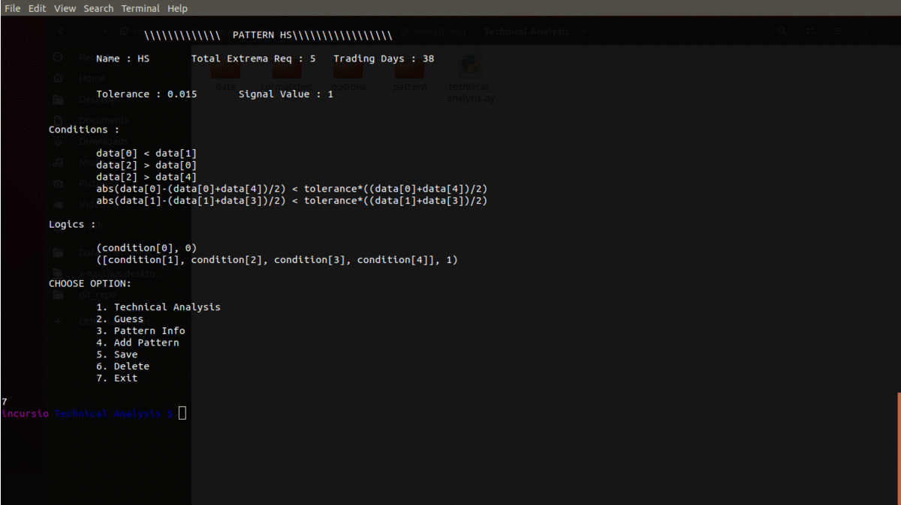

# Automated Technical Indicator

This project is built to automate the process of pattern search or charting and generating the visuals clearly marked with extrema over dataset plot. In this console based application, user can search for pre-built patterns in the given data or by using his own dataset. User also has an option to introduce new patterns and use them for further search.

Charting is a very tedious job with searching same patterns repeatedly over different dataset or even different timestamp of same dataset. Automating this repetitive work reduces the pattern search processing time to just computational time (no doubt, very less!). Also, with the use of more descriptive visuals more information can be gained with the insights. 

Introducing a automated search system, limits the pattern search to a narrow path of predefined patterns. The evolution and advancement in pattern theory can make this whole project useless with time. Hence, the option to add and save new patterns results in more robust system.

In case, user want to use different dataset, move the data to ``/Techinical Analysis/data `` folder.

To get the deep understanding of the files, functions and attributes and key concepts behind pattern search read this [document](https://github.com/rajatgarg149/Technical-Analysis/blob/master/Technical%20Indicator%5BBlog%5D.pdf).

Read the [description manual](https://github.com/rajatgarg149/Technical-Analysis/blob/master/Description%20Manual.pdf) clearly to understand the step-by-step procedure and task appropriate varying options.

